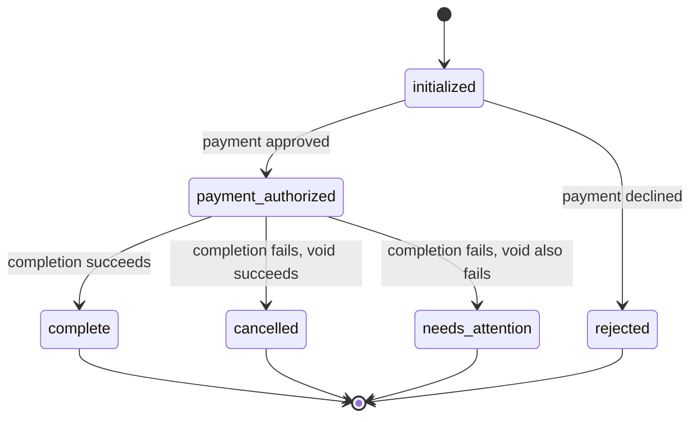

# Gametime Order State Machine (Prototype)

A small TypeScript service modeling the checkout backend's order state
machine, with stage-dependent failure recovery: a payment decline just
rejects; a completion failure after payment was authorized voids the
payment; if the void also fails, the order is surfaced as `needs_attention`
instead of being silently marked cancelled.

The full assessment prompt is preserved in [ASSESSMENT.md](./ASSESSMENT.md).

## TL;DR

- **Happy path:** `initialized` -> `payment_authorized` -> `complete`
- **Payment declined:** order becomes `rejected`; no completion or void is attempted.
- **Completion fails after authorization, void succeeds:** order becomes `cancelled`.
- **Completion fails, void also fails:** order becomes `needs_attention`, both failure reasons are persisted, and a non-success error is surfaced.
- **Unexpected gateway throws/rejections:** normalized at the service boundary so recovery behavior still runs instead of leaking raw dependency errors.

**Stack:** Node.js + TypeScript strict + Fastify + Zod + Vitest + ESLint.

## What was built and why

- **`src/domain/order.ts`** — the state machine itself. Six states
  (`initialized`, `payment_authorized`, `complete`, `rejected`, `cancelled`,
  `needs_attention`), a single transition table, and an `Order` aggregate
  whose only mutator (`transitionTo`) updates current state and appends a
  history entry (from-state, to-state, UTC timestamp, structured reason) in
  one step. This is the one file to read to understand the whole machine.
- **`src/app/order-service.ts`** — orchestration. Decides which dependency to
  call for a given command, guards illegal transitions *before* touching any
  dependency, and enforces the ordering rule "void before cancelling."
- **`src/gateways/*`** — `PaymentGateway` (authorize/void) and `OrderCompletionGateway`
  (complete), the two stubbed external gateways.
- **`src/fakes/*`** — deterministic, configurable test doubles for both
  gateways (used by both the test suite and the demo runner).
- **`src/http/*`** — a thin Fastify layer: four command-oriented endpoints,
  light Zod validation of request *shape* only, and centralized domain-error
  → HTTP-status mapping.
- **`src/demo.ts`** — runs and prints all four required scenarios end to end.

I chose a small layered structure (domain → app → gateways/fakes → http)
instead of a single file so the state machine's rules stay isolated and
easy to find, without introducing a framework, database, or DI container —
none of which this problem needs.

**Fast reviewer path:** read `src/domain/order.ts`,
`src/app/order-service.ts`, and `test/app/order-service.test.ts`. Those three
files cover the state machine, the stage-dependent recovery orchestration,
and the four required scenarios.

## Quick tour

```text
src/
|-- domain/
|   |-- order.ts                         # state machine, transition table, history
|   |-- errors.ts                        # domain errors
|   `-- clock.ts                         # injectable timestamp source
|-- app/
|   |-- order-service.ts                 # command orchestration and compensation
|   |-- order-repository.ts              # repository contract + in-memory implementation
|   `-- errors.ts                        # application-level failures
|-- gateways/
|   |-- payment-gateway.ts               # authorize/void external dependency shape
|   `-- order-completion-gateway.ts      # completion dependency shape
|-- fakes/
|   |-- fake-payment-gateway.ts          # deterministic gateway fake for tests/demo
|   `-- fake-order-completion-gateway.ts # deterministic completion fake
|-- http/
|   |-- server.ts                        # Fastify routes and error mapping
|   |-- schemas.ts                       # Zod request validation
|   `-- serialize-order.ts               # API response shaping
|-- demo.ts                              # deterministic scenario runner
`-- index.ts                             # HTTP entrypoint

test/
|-- domain/order.test.ts                 # transition/history invariants
|-- app/order-service.test.ts            # required scenarios + recovery guards
|-- app/order-repository.test.ts         # in-memory persistence behavior
|-- fakes/fakes.test.ts                  # fake gateway behavior
|-- http/orders.test.ts                  # route wiring and error mapping
`-- health.test.ts                       # health endpoint
```

## TypeScript posture

Zod schemas own HTTP request-shape validation, and exported request types are
inferred from those schemas with `z.infer` rather than duplicated by hand. The
code avoids `any` in favor of `unknown` at dependency/error boundaries, uses
`as const satisfies` where literal data should still be exhaustively checked,
and enables `noUncheckedIndexedAccess` so indexed reads must handle missing
values. Interfaces are intentionally still used for gateway and repository
contracts because classes implement them cleanly and that wording matches the
architecture.

## Architecture and the central domain invariant



**Central invariant:** once an order reaches `payment_authorized`, it must
always resolve to `complete`, `cancelled`, or `needs_attention` — it can
never be silently lost, and it can never be marked `cancelled` unless the
void actually succeeded. `needs_attention` exists specifically so a failed
void is never mistaken for a clean cancellation.

This is enforced in three places that work together:

1. `Order.transitionTo` centralizes the legal-transition table, so state and
   history can never disagree (they change in the same call), and an
   illegal transition throws instead of silently no-opping.
2. `OrderService.completeOrder` never calls `markCancelledAfterVoid` until
   after it has awaited the void call and inspected its result, and when the
   void fails it persists `needs_attention` **before** throwing
   `PartialFailureError`, so the failure is both recorded and impossible to
   ignore.
3. `OrderService.callDependency` wraps every external call (`authorize`,
   `complete`, `void`) and normalizes a thrown/rejected error into the same
   result shape used for an explicit failure outcome. A `Promise<T>` return
   type never guarantees the promise won't reject, so without this, a
   dependency that throws instead of returning `{ outcome: 'failed' }` would
   skip the void entirely and leave the order stuck in `payment_authorized`
   with an unhandled exception — silently violating the invariant above.

## How to run it

```bash
npm install

npm test          # full suite (41 tests)
npm run build     # type-check + compile to dist/
npm run lint      # eslint

npm run demo      # prints all 4 required scenarios with full history

npm run dev       # start the API with live reload (tsx watch)
npm start         # start the API from the compiled dist/ (after npm run build)
```

The API listens on `PORT` (default `3000`).

## Reviewer checklist

The assessment's required scenarios are covered in
[`test/app/order-service.test.ts`](./test/app/order-service.test.ts). A quick
review pass can use this checklist:

| Question to verify | Where it is covered |
|--------------------|---------------------|
| Can an order complete after a successful authorization? | `OrderService - happy path` |
| Does a payment decline reject the order without cleanup? | `OrderService - payment decline` |
| Is payment voided before a failed completion becomes `cancelled`? | `OrderService - completion failure, void succeeds` |
| Is a failed void persisted as `needs_attention` and surfaced as an error? | `OrderService - completion failure, void also fails` |

Additional tests cover the domain transition matrix, dependency rejections,
HTTP error mapping, deterministic fakes, and the in-memory repository. The
current suite is 41 tests, all run by `npm test`.

## Assessment coverage

- **Model states, valid transitions, and timestamped history:**
  `src/domain/order.ts`
- **Handle failures differently by stage:** `OrderService.authorizePayment`
  rejects payment declines, while `OrderService.completeOrder` voids payment
  after completion failure.
- **Surface partial failures:** failed completion plus failed void persists
  `needs_attention` and raises `PartialFailureError`; the HTTP layer maps it
  to a non-success response.
- **Expose a small API:** create, authorize payment, complete, and read order
  state/history.
- **Stub payment behind an interface:** `PaymentGateway`, with deterministic
  fakes for tests and demos.
- **Required tests:** the four named scenarios are listed in the reviewer
  checklist above.
- **Submission README topics:** what was built and why, how to run it,
  tradeoffs, more-time improvements, and AI usage are all documented here.

## Example API commands

```bash
# create an order
curl -s -X POST http://localhost:3000/orders

# authorize payment (use the id returned above)
curl -s -X POST http://localhost:3000/orders/<id>/authorize-payment

# complete the order
curl -s -X POST http://localhost:3000/orders/<id>/complete

# read current state + full history
curl -s http://localhost:3000/orders/<id>
```

There is deliberately **no** endpoint that lets a caller assign an arbitrary
state — only the four commands above exist, matching the four real actions
in the domain.

### Error mapping

| Situation                                                             | Status | Body `code`                                                                                         |
| --------------------------------------------------------------------- | ------ | --------------------------------------------------------------------------------------------------- |
| Unknown order id                                                      | 404    | `ORDER_NOT_FOUND`                                                                                   |
| Illegal transition (e.g. completing before authorization)             | 409    | `INVALID_TRANSITION`                                                                                |
| Malformed request (e.g. invalid id format)                            | 400    | `INVALID_REQUEST`                                                                                   |
| Completion fails and the void also fails                              | 502    | `ORDER_NEEDS_ATTENTION` (body includes `orderId`, `state: "needs_attention"`, both failure reasons) |
| Unexpected payment-gateway error during authorization (not a decline) | 502    | `PAYMENT_GATEWAY_ERROR`                                                                             |

The API is wired to fake payment/completion dependencies configured to
always succeed (there's no real provider to integrate with). To see the
failure and recovery scenarios, use `npm run demo`, which builds its own
`OrderService` instances with fakes configured to decline/fail — the HTTP
API intentionally exposes no toggles for this, per the constraint to keep
test-only controls out of the production-shaped surface.

## Tradeoffs

- **In-memory persistence only.** No database — an assessment-scale
  in-memory `Map` is enough to demonstrate the invariants, and adding a
  database would mean testing infrastructure instead of the state machine.
  The code depends on an `OrderRepository` interface, so a durable
  implementation could replace the in-memory repository without changing the
  domain or service layers.
- **Completion is stubbed the same way as payment**, even though the prompt
  only required stubbing payment. There's no way to test a completion
  failure otherwise, so `OrderCompletionGateway` exists as a second, symmetrical
  gateway rather than a hard-coded failure switch.
- **No simulation flags on the public API.** Another reasonable demo-oriented
  shape would be request flags like `simulateCompletionFailure` and
  `simulateVoidFailure`, especially if there were a browser UI or e2e tests
  that needed to trigger those paths over HTTP. I kept the HTTP contract closer
  to a production command surface instead: failures are produced by injected
  gateway behavior in tests and by `npm run demo`, not by caller-controlled
  test switches on `POST /orders/:id/complete`.
- **HTTP routes are tested, but kept thin.** The route tests cover request
  validation, route wiring, and error mapping. The exhaustive lifecycle
  assertions live one layer down in `OrderService`, where the dependency fakes
  can precisely control payment, completion, void, and thrown/rejected gateway
  outcomes without turning the API into a test harness.
- **Gateway fakes are deterministic, not stochastic.** The fakes do not
  randomly fail. Tests and demos configure each outcome explicitly so failures
  are reproducible; a real payment or fulfillment adapter would add retries,
  timeouts, and idempotency around non-deterministic network behavior.
- **`needs_attention` is terminal for this API.** There's no
  manual-resolution endpoint; the prompt asks to *surface* partial failures,
  not to build the resolution workflow.
- **An unexpected (non-decline) authorization error is treated differently
  from a decline.** A decline is a known business outcome and transitions
  the order to `rejected`. A technical error (e.g. gateway timeout) leaves
  the order `initialized` and throws `PaymentAuthorizationError` instead,
  because we don't actually know whether a charge occurred and shouldn't
  guess by labeling it a clean rejection.
- **HTTP 502 for `needs_attention` and gateway errors** is an interpretation
  call — the prompt only says "a clearly non-success response"; 502 was
  chosen because both cases stem from an upstream dependency failure, and
  it's clearly outside the 2xx/4xx ranges already used for client-caused
  outcomes.
- **No Swagger/OpenAPI.** With only four endpoints and this README's curl
  examples, generating and maintaining an OpenAPI spec (plus the
  Zod-to-schema wiring) would add configuration disproportionate to what it
  documents.

## Production concerns deliberately omitted

- Durable storage, migrations, and backup/restore.
- Retries, timeouts, and idempotency keys for the payment gateway (a real
  gateway call can fail without you knowing if it actually succeeded —
  idempotency keys are how you'd resolve that safely).
- Concurrency control: two simultaneous requests against the same order id
  are not locked in this prototype (in-memory `Map` writes aren't atomic
  across an `await` boundary). A real system would need optimistic
  concurrency (version numbers) or per-order locking.
- Alerting/paging and an operator workflow for resolving `needs_attention`
  orders — today it's just an inspectable state with structured reasons.
- AuthN/AuthZ on the HTTP API.
- Structured logging/metrics/tracing beyond Fastify's default request logs.
- Horizontal scaling / multi-instance coordination.

## What I'd do differently with more time

- Add a manual-resolution endpoint/workflow for `needs_attention` orders
  (e.g., an operator marking one resolved after manual investigation, with
  its own audit trail and an operator note explaining the resolution).
- Add idempotency keys to `authorizePayment`/`completeOrder` so retried
  client requests can't double-call the payment gateway.
- Add a real payment adapter (for example Stripe) behind the existing
  `PaymentGateway` interface.
- Add a retry policy with backoff around payment voids before falling through
  to `needs_attention`.
- Add optimistic concurrency (a version field) to guard against races on the
  same order id.
- Add structured logs/metrics/traces around each command, including from-state,
  to-state, gateway outcome, and failure reason.
- Generate an OpenAPI spec once the API surface is more than four endpoints.
- Property-based tests over the transition table itself (e.g., fast-check)
  to assert no state can reach an undeclared transition, rather than only
  the specific transitions exercised by hand-written tests.

## AI usage

I used an AI coding assistant throughout this exercise for:

- **Working through the state machine design** (states, transition table,
  reason codes) before writing code, to catch ambiguities — e.g., whether a
  technical authorization error should be treated the same as a decline —
  early instead of discovering them mid-implementation.
- **Generating boilerplate** (Fastify route wiring, Zod schemas, repository
  and fake implementations) from an agreed design, which I reviewed for
  correctness rather than writing by hand.
- **An adversarial test-review pass**: I asked it to look for tests that
  would still pass under specific regressions (e.g., "cancelled marked
  before void completes," "needs_attention never actually persisted"). That
  review caught a real gap — the in-memory repository stores objects by
  reference, so a naive "read the order back and check its state" assertion
  would still pass even if `repository.save()` were removed before throwing
  `PartialFailureError`. I validated the fix by temporarily deleting that
  `save()` call, confirming the strengthened test failed, then restoring it
  — rather than trusting the new test's intent without proof.
- **A reviewer-raised gap**: a second review pointed out that `authorize()`,
  `complete()`, and `void()` were only handled when they *returned* a
  failure result object — a rejected/thrown call from any of them would
  either skip the void or surface a raw, unmapped error. I fixed this with a
  single `callDependency` boundary that normalizes a thrown error into the
  same outcome shape already handled, and validated it the same way: I
  temporarily removed the wrapper around the completion call, confirmed the
  new throwing-test-double test failed, then restored it.
- I did not accept suggestions to add a state-machine library, ORM, message
  queue, or DI container — those seem disproportionate to a
  3-hour prototype and intentionally left out.
